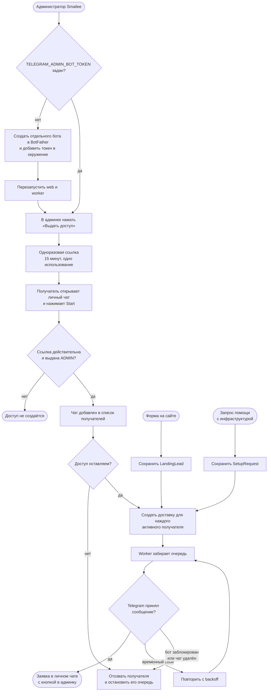

# Закрытый Telegram-бот администратора

Отдельный служебный бот не связан с клиентским Telegram-ботом и не получает
клиентские лиды из рассылок. Он принимает только заявки самого Smailee: форму
на сайте и запрос «Помочь с инфраструктурой».

Доступ выдаёт пользователь с ролью `ADMIN` одноразовой ссылкой на 15 минут.
Получателей может быть несколько; каждого можно отозвать в админке. Сначала
заявка сохраняется в основной таблице, затем для всех активных получателей
создаются записи очереди. Поэтому сбой Telegram не теряет заявку и не ломает
ответ формы: worker повторяет доставку с увеличивающейся задержкой.

**Когда обновлять.** При добавлении нового типа системного уведомления,
изменении правил доступа, источника заявок, очереди или политики повторов.
