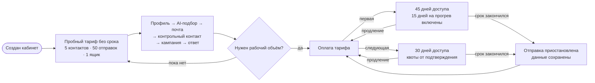

# Тариф: от пробного запуска до рабочего объёма

Новый кабинет получает бессрочный пробный тариф. Он позволяет пройти реальный пользовательский путь: обработать до 5 контактов через AI-подбор, подключить один почтовый ящик и выполнить до 50 отправок. Пробные квоты считаются за всё время и не обновляются ежемесячно.

Первый подтверждённый платёж открывает 45 дней доступа: обычный 30-дневный период и 15 дополнительных дней на прогрев новых ящиков без отдельной платы. Каждый следующий подтверждённый платёж открывает новый 30-дневный период. Квоты AI-поиска, новых уникальных email из своей базы и писем считаются от подтверждения текущего платежа и обновляются только после подтверждения следующей оплаты. После окончания доступа данные остаются доступны для просмотра, но работа с базой и кампаниями приостанавливается до оплаты. Сам пробный тариф срока окончания не имеет; загрузка своей базы ограничена общим порогом 50 контактов за всё время.

Виртуальное демо-пространство не создаётся и не включается при регистрации. Оно остаётся отдельным продуктовым инструментом и может быть задействовано позднее независимо от тарифа.

## Миграция прежних демо-пользователей

Миграция `20260821121000_convert_demo_users_to_trial` переводит пользователей с `isDemo=true` на `TRIAL`, очищает дату окончания и выключает связанное виртуальное демо-пространство. Демо-данные не удаляются.

**Когда обновлять.** Если меняются планы, квоты, период их расчёта, точки блокировки, оплата или правила выдачи пробного доступа.
