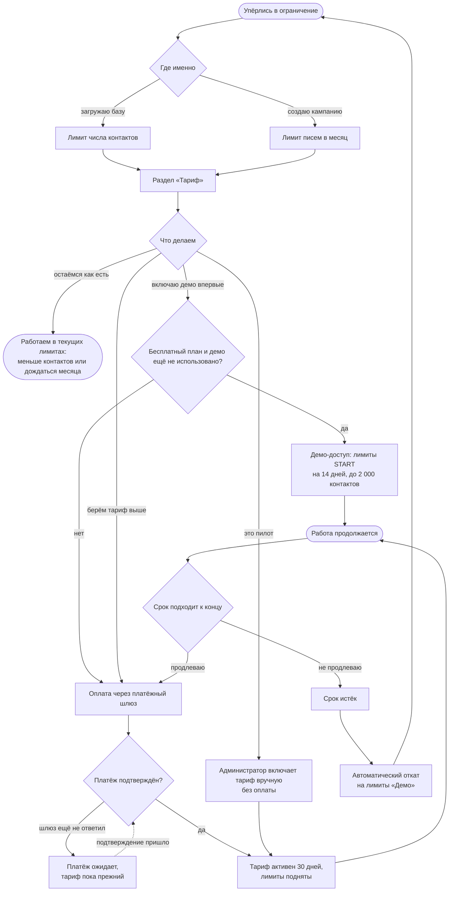

# Тариф: от упёртого лимита до поднятых квот

Начало — упёрлись в ограничение, конец — **лимиты подняты и работа
продолжается** (либо осознанно остались на текущем тарифе). Процесс идёт
фоном через всю работу: сам по себе тариф не нужен, о нём вспоминают в момент
отказа.

Тариф всегда возвращается к «Демо» по истечении срока — отдельного действия
для этого не требуется, поэтому цикл замкнут.

**Когда обновлять.** Если меняются точки, где пользователь упирается в лимит,
или путь оплаты и продления.

**Как править.** Карандаш в интерфейсе GitHub (вкладка Preview покажет
результат) либо `npm run diagram:link docs/diagrams/billing.md`.

