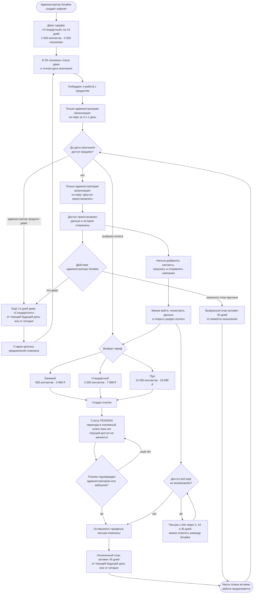

# Тариф: от демо-доступа до оплаты или заморозки

Начало — администратор Smailee создаёт кабинет клиента, конец цикла — **активный оплаченный доступ** либо **замороженный кабинет с сохранёнными данными**. Бесплатного рабочего тарифа нет.

Новый кабинет получает демо-доступ к тарифу «Стандартный» на 14 дней: до 2 000 контактов и 5 000 писем в месяц. В общей шапке кабинета владельцу и сотрудникам видна дата окончания доступа. Сам раздел «Тариф и оплата» доступен только администратору организации или сотруднику с отдельным правом. Администратор Smailee видит отметку демо и может продлить его ещё на 14 дней.

После окончания демо или оплаченного периода данные остаются доступны для просмотра, но добавление контактов, запуск кампаний, фоновая отправка и follow-up приостанавливаются. Сохранённая очередь продолжает работу после оплаты или продления.

О завершении демо администраторы организации получают письма с `no-reply` за
3 и 1 день. При любой приостановке доступа — естественном окончании демо
или оплаченного периода либо ручном отключении — им приходит письмо о
приостановке с `no-reply`. Исключение — бесшовное переключение на другой
активный тариф. Если доступ не возобновлён, через 3, 10 и 30 дней приходят
реактивационные письма с `info@smailee.ru`. Покупка тарифа или продление демо
отменяет все оставшиеся письма старой цепочки; платёж `PENDING` её не отменяет.

Платёжный шлюз пока не подключён. Кнопка «Оплатить» создаёт запись со статусом
`PENDING`, но не переводит пользователя на внешнюю оплату. Для текущей ручной
проверки платёж подтверждается в админке Smailee; тот же результат умеет
принимать совместимый вебхук `/api/payments/webhook`.

Доступные платные планы:

| План | Контакты | Письма в месяц | Цена |
|---|---:|---:|---:|
| Базовый | 500 | 1 250 | 3 990 ₽/мес |
| Стандартный | 2 000 | 5 000 | 7 999 ₽/мес |
| Про | 10 000 | 30 000 | 19 999 ₽/мес |

**Когда обновлять.** Если меняются планы, квоты, длительность демо, точки блокировки, оплата или ручное управление доступом.

