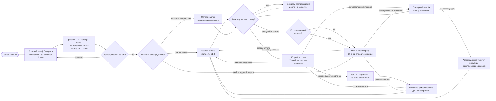

# Тариф: от пробного запуска до рабочего объёма

Новый кабинет получает бессрочный пробный тариф. Он позволяет пройти реальный пользовательский путь: обработать до 5 контактов через AI-подбор, подключить один почтовый ящик и выполнить до 50 отправок. Пробные квоты считаются за всё время и не обновляются ежемесячно.

Первый подтверждённый платёж открывает 45 дней доступа: обычный 30-дневный период и 15 дополнительных дней на прогрев новых ящиков без отдельной платы. Каждый следующий подтверждённый платёж добавляет 30 дней к ещё не истёкшему доступу; если доступ уже закончился, новый период начинается с момента подтверждения. При продлении или смене тарифа оплаченные дни не сгорают. Новый тариф включается сразу после оплаты, а его 30 дней добавляются после текущей оплаченной даты. Smailee продаётся как подписка, поэтому автопродление выбрано по умолчанию; до оплаты пользователь видит сумму и график списаний и может снять флажок для разовой оплаты. Первый повторный платёж выполняется через 45 дней после подтверждения первой оплаты, затем — каждые 30 дней. Автопродление можно отключить в кабинете в любой момент, уже оплаченный доступ при этом сохраняется до указанной даты.

Если у организации уже включено автопродление, подтверждённая оплата другого тарифа заменяет прежнюю подписку: старое автопродление отключается, новый тариф включается сразу, а следующая дата списания ставится после всего сохранённого и добавленного срока. До подтверждения нового платежа текущая подписка не меняется.

Пояснение про 45 дней и прогрев показывается отдельной плашкой только организации без единого подтверждённого платежа. После первой оплаты плашка исчезает, а подпись подписки показывает обычный 30-дневный цикл; поэтому владелец действующего тарифа не видит уже неактуальный бонус первого периода.

Квоты AI-поиска, новых уникальных email из своей базы и писем считаются от подтверждения текущего платежа и обновляются только после подтверждения следующей оплаты. Доступ включается только после подписанного подтверждения банка; повторная доставка одного события не продлевает его дважды. Если повторное списание не подтверждено, новый период не включается и повторное списание без нового безопасного основания не запускается. После окончания доступа данные остаются доступны для просмотра, но работа с базой и кампаниями приостанавливается до оплаты. Сам пробный тариф срока окончания не имеет; загрузка своей базы ограничена общим порогом 50 контактов за всё время.

Виртуальное демо-пространство не создаётся и не включается при регистрации. Оно остаётся отдельным продуктовым инструментом и может быть задействовано позднее независимо от тарифа.

## Миграция прежних демо-пользователей

Миграция `20260821121000_convert_demo_users_to_trial` переводит пользователей с `isDemo=true` на `TRIAL`, очищает дату окончания и выключает связанное виртуальное демо-пространство. Демо-данные не удаляются.

**Когда обновлять.** Если меняются планы, квоты, период их расчёта, точки блокировки, оплата или правила выдачи пробного доступа.
