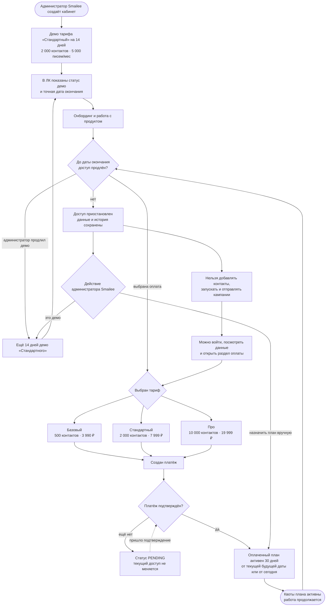

# Тариф: от демо-доступа до оплаты или заморозки

Начало — администратор Smailee создаёт кабинет клиента, конец цикла — **активный оплаченный доступ** либо **замороженный кабинет с сохранёнными данными**. Бесплатного рабочего тарифа нет.

Новый кабинет получает демо-доступ к тарифу «Стандартный» на 14 дней: до 2 000 контактов и 5 000 писем в месяц. В интерфейсе владельца и сотрудников всегда видна дата окончания доступа. Администратор Smailee видит отметку демо и может продлить его ещё на 14 дней.

После окончания демо или оплаченного периода данные остаются доступны для просмотра, но добавление контактов, запуск кампаний, фоновая отправка и follow-up приостанавливаются. Сохранённая очередь продолжает работу после оплаты или продления.

Доступные платные планы:

| План | Контакты | Письма в месяц | Цена |
|---|---:|---:|---:|
| Базовый | 500 | 1 250 | 3 990 ₽/мес |
| Стандартный | 2 000 | 5 000 | 7 999 ₽/мес |
| Про | 10 000 | 30 000 | 19 999 ₽/мес |

**Когда обновлять.** Если меняются планы, квоты, длительность демо, точки блокировки, оплата или ручное управление доступом.

