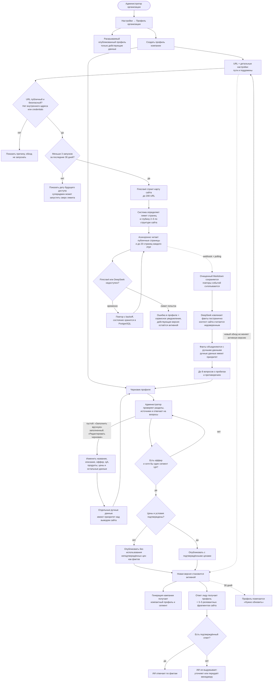

# Профиль организации: автоматическое и ручное заполнение

Профиль принадлежит организации и является единым подтверждённым контекстом для генерации кампаний и ответов лидам. Настраивать и публиковать его может только администратор организации. Сотрудники используют опубликованную версию косвенно — в пределах своих прав на кампании и лиды.

Это единственная точка редактирования сведений об организации. В «Основных настройках» остаются только ссылка и статус профиля; прежние поля владельца хранятся как техническое зеркало опубликованной версии и не могут переопределить её. Черновик, ручные подтверждённые данные и опубликованная версия разделены: повторный обход сайта не наследует выводы предыдущего анализа как будто их ввёл администратор.

Полнотекстовый поиск PostgreSQL используется только для выбора дополнительных выдержек под конкретный вопрос лида. Весь сайт не отправляется в каждый LLM-запрос. Архитектурный интерфейс crawler и retrieval оставляет возможность позднее заменить Firecrawl или добавить гибридный поиск с `pgvector`, не меняя пользовательский путь.

Сырые тексты страниц очищаются через 90 дней; опубликованные версии, извлечённые факты и ответы администратора сохраняются. Новый обход всегда создаёт черновик и не подменяет действующий контекст без явной публикации.
