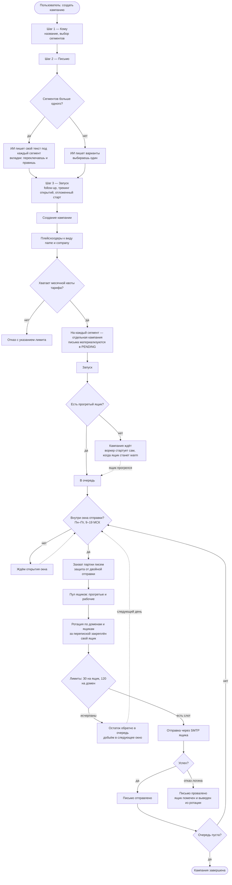

# Запуск кампании

Путь от «создать кампанию» в мастере до отправленного письма. Укрупнённо: только
то, что видит и проходит пользователь, плюс решения движка, которые меняют исход.

**Когда обновлять.** Если изменение добавляет, убирает или переставляет шаг, через
который проходит пользователь, либо меняет условие ветвления — диаграмма
устарела. Внутренние правки (как именно устроен захват партии, как
классифицируется ошибка) сюда не попадают намеренно.

**Как править.** Прямо здесь: карандаш в интерфейсе GitHub, вкладка Preview
показывает результат, коммит уходит в репозиторий. Либо в живом редакторе с
мгновенным превью — `npm run diagram:link docs/diagrams/campaign-launch.md`,
и потом вернуть правку обратно: `npm run diagram:pull <файл> "<ссылка>"`.

