# Рассылка: от замысла до закрытия линии

Главный процесс продукта. Начало — решение создать кампанию, конец — **линия
закрыта** по конкретному контакту, любым из способов: передали продавцу,
получили отказ, цепочка кончилась без ответа.

Один процесс, а не несколько: создание, отправка, диалог и квалификация не
имеют самостоятельного «конца» — кампания не завершена, пока по каждому
контакту не наступил один из финалов.

**Когда обновлять.** Если изменение добавляет, убирает или переставляет шаг,
через который проходит пользователь, либо меняет условие ветвления. Внутренние
правки (как устроен захват партии писем, как классифицируется ошибка SMTP)
сюда не попадают намеренно.

**Как править.** Прямо здесь: карандаш в интерфейсе GitHub, вкладка Preview
показывает результат, коммит уходит в репозиторий. Либо в живом редакторе с
мгновенным превью — `npm run diagram:link docs/diagrams/campaign.md`, потом
вернуть правку обратно: `npm run diagram:pull <файл> "<ссылка>"`.

```mermaid
flowchart TD
  Start([Создать кампанию]) --> Who[Шаг 1 — Кому<br/>название и сегменты]
  Who --> Multi{Сегментов больше одного?}
  Multi -->|да| PerSeg[ИИ пишет свой текст под каждый сегмент<br/>вкладки: переключаешь и правишь]
  Multi -->|нет| One[ИИ пишет варианты, выбираешь один]
  PerSeg --> Edit
  One --> Edit[Правки: пишешь замечания, ИИ переписывает]
  Edit --> Decor[Оформление: фирменный каркас,<br/>картинки, готовый шаблон]
  Decor --> Chain[Цепочка follow-up:<br/>сколько писем и с каким интервалом]
  Chain --> Track[Трекинг открытий и кликов<br/>по умолчанию выключен]
  Track --> Quota{Хватает месячной квоты тарифа?}

  Quota -->|нет| Deny[Отказ с указанием лимита]
  Quota -->|да| Materialize[На каждый сегмент — своя кампания<br/>письма встают в очередь]

  Materialize --> Mode{Как запускаем}
  Mode -->|отложенно| WaitTime[Ждём назначенного времени]
  Mode -->|после прогрева| WaitWarm[Ждём, пока ящик станет прогретым]
  Mode -->|сразу| Warm
  WaitTime -.-> Warm
  WaitWarm -.-> Warm

  Warm{Есть прогретый ящик?}
  Warm -->|нет| WaitWarm
  Warm -->|да| Window{Рабочее окно?<br/>Пн–Пт, 9–19 МСК}
  Window -->|нет| Hold[Ждём открытия окна]
  Hold -.-> Window
  Window -->|да| Allowed{Контакт активен<br/>и не в стоп-листе?}

  Allowed -->|нет| Skipped([Линия закрыта:<br/>контакт заблокирован])
  Allowed -->|да| Limits{Лимиты не исчерпаны?<br/>30 на ящик, 120 на домен}
  Limits -->|исчерпаны| Tomorrow[Остаток ждёт следующего дня]
  Tomorrow -.-> Window
  Limits -->|есть слот| Send[Письмо уходит через SMTP ящика<br/>за перепиской закреплён свой ящик]

  Send --> Ok{Отправлено?}
  Ok -->|отказ сервера| Failed[Письмо провалено,<br/>ящик уходит на проверку мониторингу]
  Ok -->|да| Sent[Письмо доставлено получателю]

  Sent --> Answered{Ответил?}
  Answered -->|нет| NextStep{Есть следующее письмо цепочки?}
  NextStep -->|да, интервал прошёл| Window
  NextStep -->|цепочка кончилась| CloseSilent([Линия закрыта:<br/>не ответил])

  Answered -->|да| Thread[Ответ склеивается в тред<br/>по заголовкам письма]
  Thread --> Qualify[ИИ разбирает ответ:<br/>тон, триггер передачи, явный отказ]

  Qualify --> OptOut{Просил больше не писать?}
  OptOut -->|да| Stop[Контакт в общий стоп-лист<br/>ИИ не отвечает]
  Stop --> CloseRefused([Линия закрыта:<br/>отказ])

  OptOut -->|нет| Trigger{Сработал триггер передачи?<br/>зовёт на созвон, готов начать…}
  Trigger -->|нет| Dialog[ИИ пишет ответ по инструкции воронки]
  Dialog --> Moderation{Модерация включена?}
  Moderation -->|да| Draft[Черновик ждёт вашего решения]
  Draft --> Decision{Одобрили?}
  Decision -->|правим и одобряем| Replied[Ответ ушёл клиенту]
  Decision -->|нет| Draft
  Moderation -->|нет| Replied
  Replied --> Answered

  Trigger -->|да| Crm{Битрикс24 подключён?}
  Crm -->|да| Push[Лид и вся переписка уходят в CRM]
  Crm -->|нет| Hold2[Лид виден в Smailee,<br/>можно передать кнопкой вручную]
  Hold2 --> Push
  Push --> CloseHandoff([Линия закрыта:<br/>передан продавцу])
```

