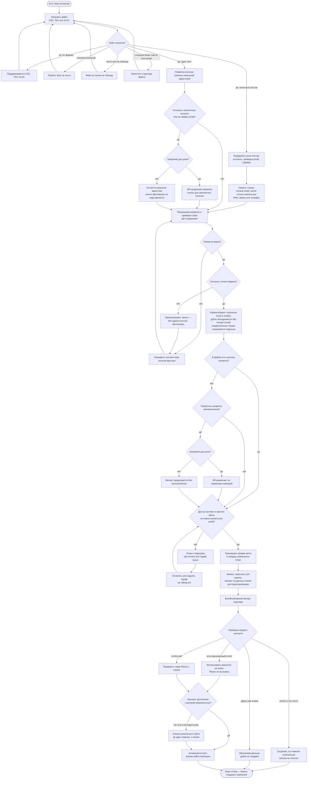

# База контактов: от файла до готовых получателей

Начало — файл с базой, конец — **контакты в системе, размеченные и готовые к
кампании**. Отдельный процесс, а не часть рассылки: базу загружают один раз и
используют во многих кампаниях.

Сюда же входит стоп-лист, но только как **фильтр на входе** — сам он
наполняется в процессе рассылки (см. `campaign.md`, ветка отказа).

**Когда обновлять.** Если меняется путь загрузки: форматы, шаги подтверждения
разметки, правила отбраковки строк.

**Как править.** Карандаш в интерфейсе GitHub (вкладка Preview покажет
результат) либо `npm run diagram:link docs/diagrams/contacts.md`.

