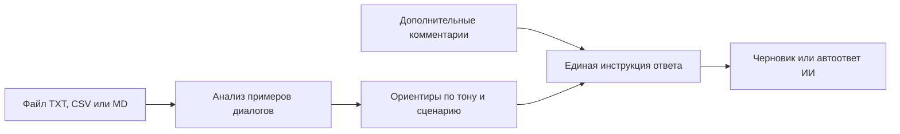
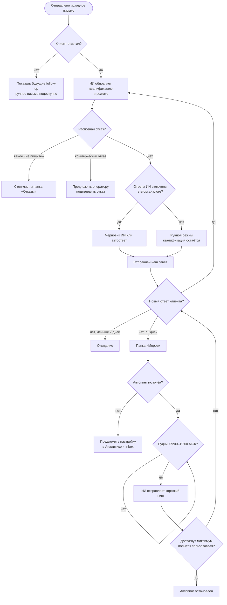

# Inbox: состояния коммуникации и автопинг

Inbox группирует письма по паре «кампания + контакт». Исходное письмо,
follow-up и ответы не создают отдельные строки. По умолчанию коммуникации
сортируются по последнему реальному событию, а обработанные скрыты.

## Как организация настраивает стиль ИИ

Файл с примерами и дополнительные комментарии можно использовать по отдельности
или одновременно. Ориентиры из диалогов и комментарии сохраняются раздельно;
при конфликте ручные комментарии имеют приоритет.

## Жизненный цикл диалога

Если клиент назвал дату следующего контакта, «Мороз» и автопинг откладываются
до неё. Черновик не считается ответом: индикатор действия снимается только
после реально отправленного исходящего письма, обработки, отказа или передачи.
