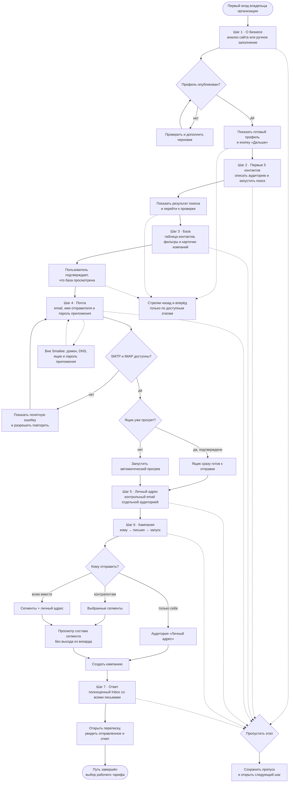

# Онбординг: от первого входа до первого ответа

Начало — владелец организации впервые входит в выданный кабинет, конец — **профиль компании опубликован, первые контакты проверены, почта подключена, первая кампания создана, а её письма и ответы видны в Inbox**.

Визард состоит из семи шагов и не выводит пользователя в другие разделы до завершения пути. Каждый шаг можно пропустить, чтобы внешняя настройка или временная ошибка не блокировала знакомство с продуктом. Стрелки позволяют возвращаться на уже пройденные этапы; там показывается сохранённый результат, а не пустой экран. Прогресс вычисляется по фактическим данным кабинета и отдельно сохранённым пропускам.

Провижининг доменов, DNS и почтовых ящиков происходит вне Smailee. Smailee подключается к готовому ящику и проверяет SMTP/IMAP реальным входом. Владелец может подтвердить, что ящик уже прогрет; иначе после подключения начинается автоматический прогрев.

**Когда обновлять.** Если меняются шаги визарда, условия их завершения, пропуск или возврат между этапами, подключение почты, аудитории первой кампании либо финальный Inbox.

Условия фактического завершения шагов: опубликован готовый профиль организации; найден хотя бы один рабочий контакт; пользователь подтвердил просмотр базы; подключён хотя бы один ящик; сохранён личный контрольный адрес; создана хотя бы одна недемо-кампания; по контрольному контакту получен ответ. Пропущенный шаг считается проходимым, но не подменяет соответствующие рабочие данные.

Контрольный адрес хранится как служебный контакт с `isControl=true` и сегментом «Личный адрес». В обычные кампании он не попадает. Только первая кампания внутри онбординга может явно включить его отдельной аудиторией.
