# Онбординг: от первого входа до первой кампании

Начало — владелец организации впервые входит в выданный кабинет, конец — **бизнес описан, ящики подключены и прогреваются, контакты загружены, первая кампания создана и готова к отправке**.

Визард состоит из шести шагов. Прогресс не хранится отдельным счётчиком: он вычисляется из фактических данных кабинета. Поэтому после закрытия и повторного открытия пользователь возвращается к первому реально незавершённому шагу. Онбординг доступен только администратору организации.

Провижининг доменов, DNS и почтовых ящиков происходит вне Smailee по инструкции. Smailee подключается к готовым ящикам и проверяет SMTP/IMAP реальным входом.

**Когда обновлять.** Если меняются шаги визарда, условия их завершения, помощь специалиста, прогрев, возврат в визард или запуск первой кампании.

```mermaid
flowchart TD
  Start([Первый вход владельца организации]) --> Welcome[Приветствие<br/>6 шагов · около 30 минут + прогрев]
  Welcome --> Path{Как настраиваем?}

  Path -->|помогите| HelpForm[Имя, контакт и удобное время]
  HelpForm --> HelpRequest[Заявка сохранена в админке<br/>письмо оператору отправляется best-effort<br/>через первый рабочий ящик]
  HelpRequest --> LeadsWithHelp([Визард закрыт<br/>специалист связывается с клиентом])

  Path -->|самостоятельно| Business[Шаг 1 · Профиль организации<br/>автоматически по сайту или вручную]
  Business --> Infra[Шаг 2 · Инфраструктура<br/>расчёт доменов, ящиков и объёма]
  Infra --> External[Вне Smailee: домены, DNS,<br/>ящики и один пароль приложения на ящик]
  External --> Guide[Всплывающая инструкция со скриншотами<br/>2 этапа · 8 экранов]

  subgraph AdminStage["Этап 1 · Админка Яндекс 360"]
    direction TB
    AdminLogin[Войти с аккаунта владельца<br/>домен подключён · тариф оплачен<br/>1 домен = 1 организация]
    AdminLogin --> Employees[Сотрудники → Добавить<br/>→ Создать вручную]
    Employees --> EmployeeData[Заполнить фамилию, имя,<br/>уникальный логин и пароль<br/>реальные ФИО можно повторять]
    EmployeeData --> NoPasswordChange[Снять галочку<br/>«Сотрудник должен изменить пароль<br/>при первом входе»]
    NoPasswordChange --> EmployeeSaved[Нажать «Добавить»]
    EmployeeSaved --> EnoughEmployees{Созданы все ящики?<br/>Не более 4 сотрудников<br/>на организацию}
    EnoughEmployees -->|нет| Employees
    EnoughEmployees -->|да| Protocols[Почта → Настройки<br/>проверить POP3 ✓ и IMAP ✓]
  end

  Guide --> AdminLogin

  subgraph MailStage["Этап 2 · Почта сотрудника"]
    direction TB
    MailLogin[Войти под созданным<br/>email и паролем]
    MailLogin --> Agreement[Принять пользовательское<br/>соглашение]
    Agreement --> Security[Настройки → Все настройки<br/>→ Безопасность → Пароли приложений]
    Security --> EnablePasswords[Включить<br/>«Использовать пароли приложений»]
    EnablePasswords --> CreatePassword[Выбрать «Почта»<br/>имя пароля — Smailee]
    CreatePassword --> CopyPassword[Скопировать пароль приложения<br/>он показывается один раз]
  end

  Protocols --> MailLogin
  CopyPassword --> Connect[Шаг 3 · Подключить ящик в Smailee<br/>обязательное имя отправителя<br/>+ email сотрудника + пароль приложения]
  ArchivedCsv[CSV-импорт пула ящиков<br/>архивирован · недоступен]:::archived
  Connect -. прежний путь .-> ArchivedCsv
  Connect --> Verify{SMTP и IMAP подтверждены<br/>одним паролем приложения?}
  Verify -->|нет| Credentials[Показать ответ сервера<br/>исправить email или пароль приложения]
  Credentials --> Connect
  Verify -->|да| Warmup[Шаг 4 · Прогрев запущен<br/>идёт автоматически]

  Warmup --> Contacts[Шаг 5 · Контакты<br/>CSV, сопоставление колонок, сегменты]
  Contacts --> Campaign[Шаг 6 · Первая кампания<br/>кому → письмо → запуск]
  Campaign --> WarmState{Есть уже прогретый ящик?}
  WarmState -->|да| Ready[Кампанию можно запустить сейчас]
  WarmState -->|нет| Schedule[Запустить после прогрева<br/>кампания ждёт автоматически]
  Ready --> Finish([Все 6 шагов завершены])
  Schedule --> Finish
  Schedule -.->|ящик стал warm| AutoLaunch[Воркер переводит кампанию в очередь<br/>и начинает отправку]

  Business -.-> Close
  Infra -.-> Close
  Connect -.-> Close
  Warmup -.-> Close
  Contacts -.-> Close
  Campaign -.-> Close
  Close{Пользователь нажал ×} --> Closed[Переход в «Лиды»<br/>баннер «Продолжить настройку»]
  Closed -->|нажал баннер| Derive{Первый незавершённый шаг<br/>по фактическим данным кабинета}
  Derive -->|1| Business
  Derive -->|2| Infra
  Derive -->|3| Connect
  Derive -->|4| Warmup
  Derive -->|5| Contacts
  Derive -->|6| Campaign

  Finish --> Lifecycle{Ящик продолжает работать}
  Lifecycle -->|временная сетевая ошибка| Retry[Автопереподключение<br/>с увеличивающимся интервалом]
  Retry -->|успех| Lifecycle
  Retry -->|1–2 неудачи| Retry
  Retry -->|3 неудачи| NetworkPaused[Ящик исключён из работы<br/>сервисное письмо администраторам организации<br/>не чаще раза в сутки]
  NetworkPaused -.->|автопроверка успешна| Lifecycle
  Lifecycle -->|ошибка пароля| AuthPaused[Ящик сразу исключён из работы<br/>повторные входы не выполняются]
  AuthPaused --> ManualFix[Администратор исправляет пароль<br/>и переподключает ящик вручную]
  ManualFix --> Lifecycle

  classDef external fill:#f8fafc,stroke:#94a3b8,color:#334155
  classDef archived fill:#f8fafc,stroke:#cbd5e1,color:#64748b,stroke-dasharray:5 5
  class AdminLogin,Employees,EmployeeData,NoPasswordChange,EmployeeSaved,EnoughEmployees,Protocols,MailLogin,Agreement,Security,EnablePasswords,CreatePassword,CopyPassword external
```

Условия завершения шагов: профиль организации опубликован и содержит оффер и хотя бы один сегмент аудитории; есть хотя бы один ящик; прогрев запущен; есть хотя бы один контакт; создана хотя бы одна кампания. Черновик профиля не открывает следующий шаг, потому что боевой ИИ использует только опубликованную версию. Информационные шаги «Инфраструктура» и «Прогрев» разрешают двигаться дальше, не дожидаясь внешних процессов.
