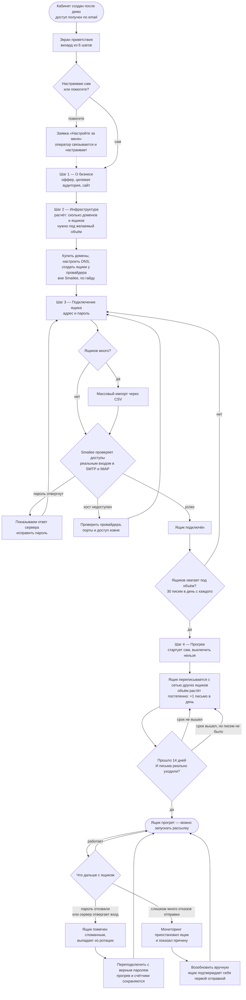

# Подготовка: от выданного доступа до рабочего ящика

Начало — первый вход после демо, конец — **прогретый ящик, готовый слать письма**. Сюда
же входит его дальнейшая жизнь: ящик может сломаться и вернуться в строй, но
из этого состояния процесс уже не «выходит».

Провижининг доменов и создание ящиков происходят **вне Smailee**, на стороне
клиента по нашему гайду — система подключается к готовым ящикам.

**Когда обновлять.** Если меняется путь настройки: шаги визарда, условия
готовности ящика, поведение при поломке.

**Как править.** Карандаш в интерфейсе GitHub (вкладка Preview покажет
результат) либо `npm run diagram:link docs/diagrams/infrastructure.md`.

