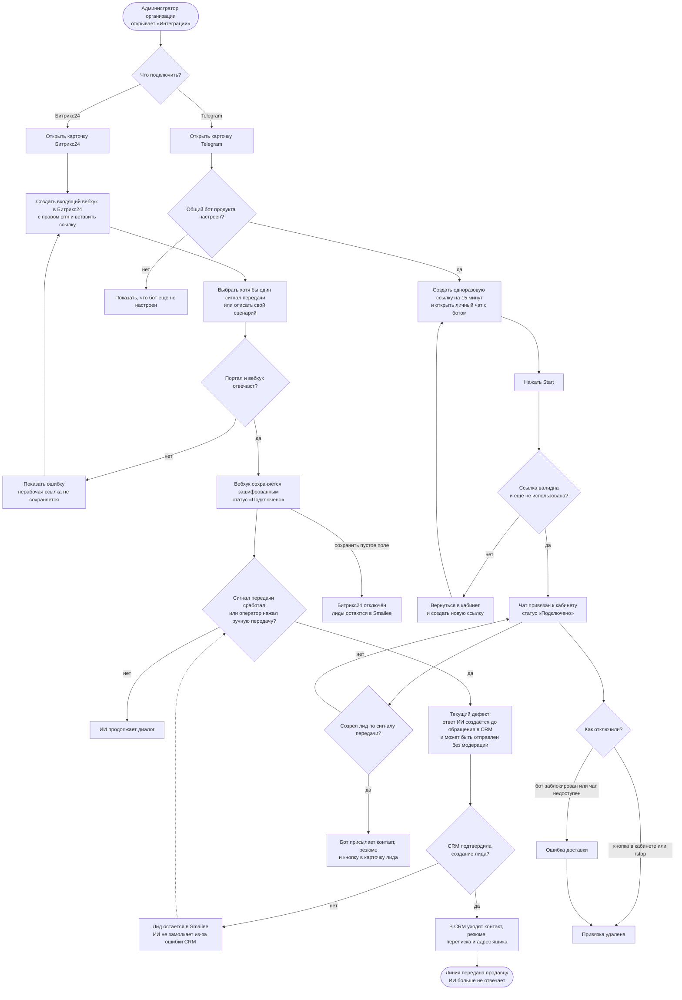

# Интеграции: Битрикс24 и Telegram

Раздел доступен только администратору организации. Битрикс24 принимает готовые
лиды и контекст переписки; Telegram присылает уведомление в личный чат, когда
сработал настроенный сигнал передачи. Интеграции независимы: можно подключить
любую одну, обе или ни одной.

При автоматическом сигнале Telegram-уведомление отправляется независимо от
того, подключён ли Битрикс24 и приняла ли CRM лид. Ручная передача в CRM сама
по себе Telegram-уведомление не создаёт.

Вебхук Битрикс24 проверяется до сохранения и хранится зашифрованным. Mock-успеха
нет: если CRM не подключена или отвергла запрос, лид не помечается переданным и
ИИ не прекращает диалог из-за ложного успеха.

Подключение Telegram использует одноразовую ссылку на 15 минут. Один чат может
быть связан только с одним кабинетом; команды `/status` и `/stop` позволяют
проверить или отключить связь. Если пользователь заблокировал бота либо чат
удалён, нерабочая привязка очищается при ошибке доставки.

**Когда обновлять.** Если добавляется интеграция, меняется способ подключения,
момент передачи лида, состав отправляемых данных или поведение при ошибке.

