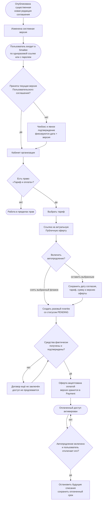
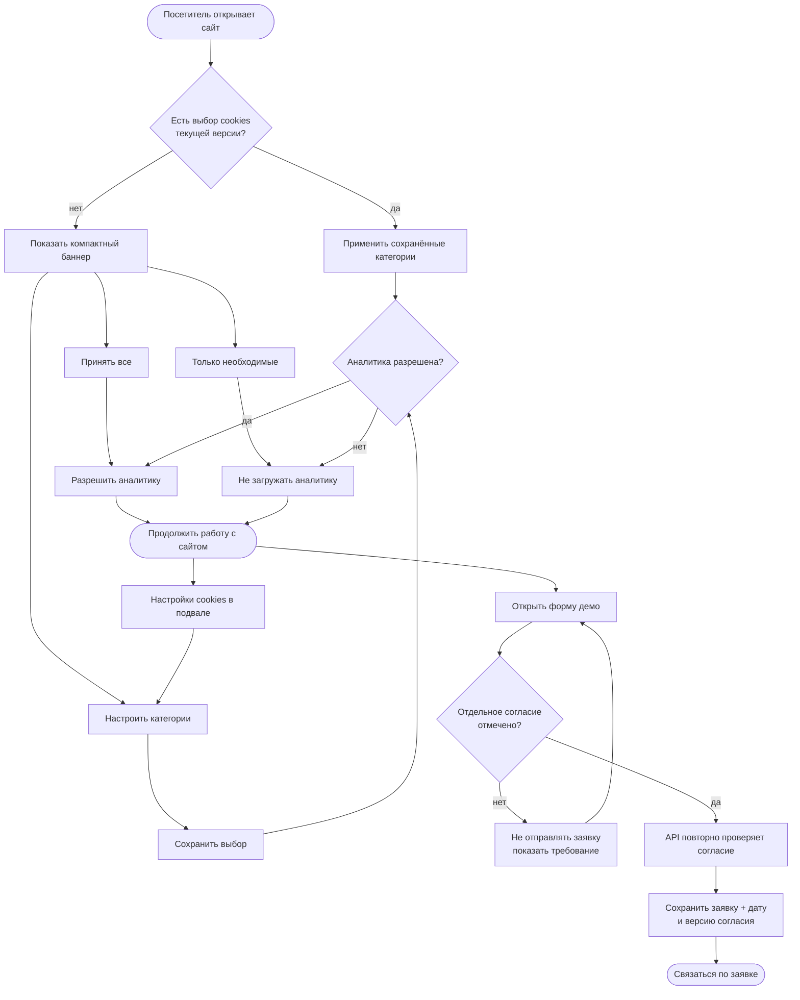

# Юридические документы, согласия и cookies

Каждый человек, работающий в кабинете, явно принимает актуальную редакцию
Пользовательского соглашения. Принятие фиксируется датой и версией документа.
Публичная оферта относится не к входу сотрудника, а к приобретению доступа
организацией: её акцептует уполномоченный плательщик оплатой выбранного тарифа,
а версия оферты сохраняется в конкретном платеже.

Заявка на демонстрацию использует отдельное согласие на обработку персональных
данных: без флажка API отклоняет форму, а у принятой заявки сохраняются дата и
версия согласия. Необходимые cookies работают для входа и хранения выбора.
Аналитика по умолчанию выключена и не загружается до явного разрешения.

Существенная новая редакция Пользовательского соглашения меняет системную
версию. При следующем входе старый акцепт больше не пропускает в кабинет:
пользователь читает новую редакцию и подтверждает её отдельно. Создание заявки
на платёж не проставляет согласие автоматически.

**Когда обновлять.** Если меняется способ регистрации, акцепта, версия
документов, состав форм, момент заключения договора, платёжный путь, категории
cookies, аналитические поставщики или круг лиц, которые могут оплачивать тариф.
