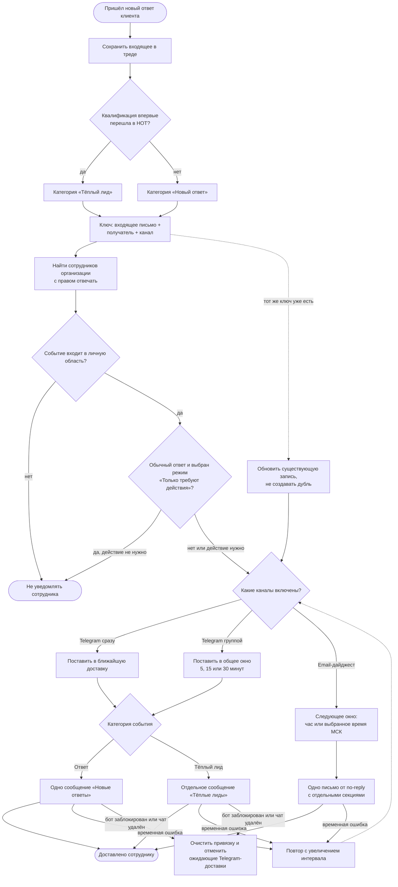

# Уведомления об ответах и тёплых лидах

Настройки персональны для каждого сотрудника. Они не расширяют серверные
права: область «Все кампании» действует только при `LEADS_REPLY_ALL`, иначе
сотрудник получает события лишь из запущенных собой кампаний. Администратор
организации также выбирает собственную область и каналы, не меняя настройки
коллег.

Telegram умеет отправлять событие сразу или собирать фиксированные окна по
5, 15 либо 30 минут. Ответы и тёплые лиды всегда образуют разные сообщения.
Email собирает оба типа в одно письмо-дайджест, но в отдельные секции; частота
— раз в час или ежедневно в выбранный час по Москве. Настройки находятся во
вкладке «Настройки → Уведомления».

Критический инвариант: если конкретный ответ сделал лида тёплым, он существует
только в категории «Тёплый лид». Категория не входит в уникальный ключ очереди,
поэтому один и тот же ответ технически не может одновременно оказаться и в
«Новых ответах», и в «Тёплых лидах» для одного канала и сотрудника.
