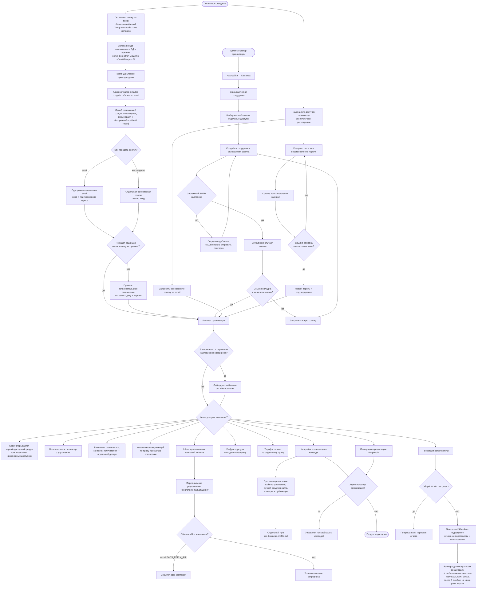

# Кабинет организации: выдача доступа, команда и пароль

Кабинет принадлежит организации, а не отдельному сотруднику. Публичной регистрации нет: будущий клиент сначала оставляет заявку на демо с обязательным email, а администратор Smailee создаёт организацию с владельцем прямо на созвоне. Основной путь — одноразовая ссылка на почту: переход одновременно авторизует и подтверждает адрес. Резервный путь — отдельная одноразовая ссылка для мессенджера: она авторизует, но не подтверждает email. Оба токена могут оставаться действительными, поэтому ручная отправка не ломает уже доставленное письмо. Логинов нет, пароль пользователь может установить по желанию. До подтверждения адреса после онбординга в кабинете показывается красное напоминание; даже неподтверждённый адрес можно использовать, чтобы запросить новую ссылку для входа. Все пароли хранятся только как bcrypt-хеши, а секреты ссылок — только как SHA-256-хеши одноразовых токенов.

Доступы проверяются на сервере для каждого действия, а не только скрывают кнопки. Если для страницы доступна лишь часть действий, недоступные элементы остаются серыми и объясняют причину при нажатии. Право «Контакты получателей кампании» дополнительно защищает имя, компанию, email и персональный предпросмотр письма. Сотрудник работает с общими данными организации; автор кампании фиксируется отдельно, чтобы ограничение «только свои кампании/лиды» было проверяемым. «Инфраструктура» и «Тариф и оплата» могут быть выданы сотруднику отдельными правами; административные вкладки «Настроек» и CRM-интеграции доступны только администратору организации. Персональная вкладка «Настройки → Уведомления» и подключение своего Telegram доступны сотрудникам с правом отвечать в Inbox; выбранная область не может расширить назначенные администратором права.

Недоступность общего API фиксируется как инцидент: баннер видит только администратор организации. Уведомление отправляется системной почтой с `SYSTEM_MAIL_FROM` на `ADMIN_EMAIL` после трёх последовательных ошибок и не чаще одного раза в сутки; несколько событий объединяются в дайджест. При следующем успешном запросе инцидент закрывается автоматически.
