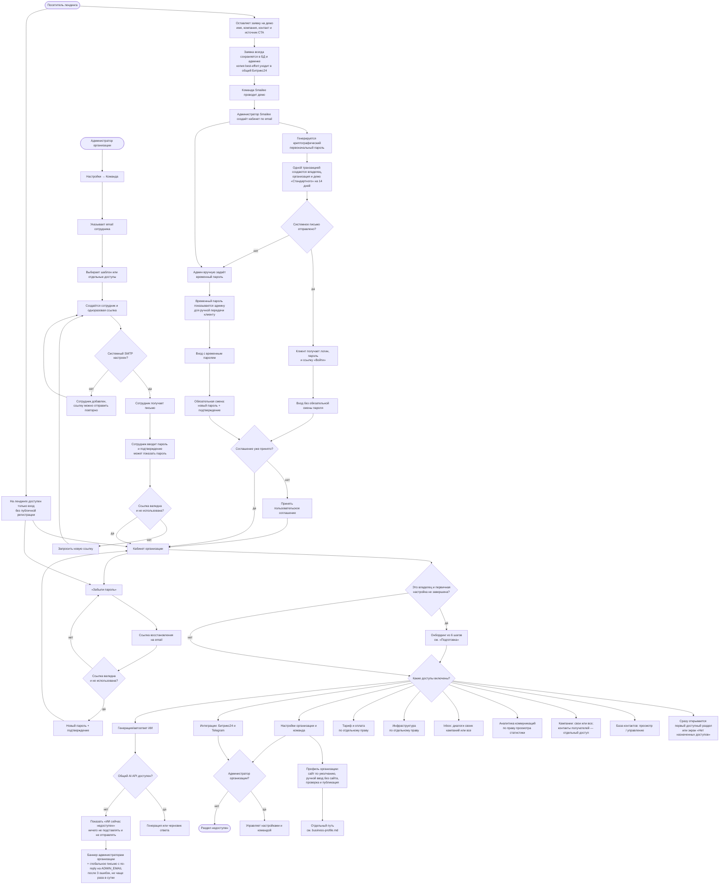

# Кабинет организации: выдача доступа, команда и пароль

Кабинет принадлежит организации, а не отдельному сотруднику. Публичной регистрации нет: будущий клиент сначала оставляет заявку на демо, администратор Smailee проводит демо и создаёт организацию с владельцем. При штатном создании постоянный пароль генерируется сервером и отправляется только клиенту; администратору он не показывается. Временный пароль — отдельный аварийный сценарий: его вручную задаёт администратор, после чего клиент обязан заменить его. Все пароли хранятся только в виде bcrypt-хеша, а ссылки приглашения и восстановления — только как SHA-256-хеш одноразового токена.

Доступы проверяются на сервере для каждого действия, а не только скрывают кнопки. Если для страницы доступна лишь часть действий, недоступные элементы остаются серыми и объясняют причину при нажатии. Право «Контакты получателей кампании» дополнительно защищает имя, компанию, email и персональный предпросмотр письма. Сотрудник работает с общими данными организации; автор кампании фиксируется отдельно, чтобы ограничение «только свои кампании/лиды» было проверяемым. «Инфраструктура» и «Тариф и оплата» могут быть выданы сотруднику отдельными правами; «Настройки» и «Интеграции» доступны только администратору организации.

Недоступность общего API фиксируется как инцидент: баннер видит только администратор организации. Уведомление отправляется системной почтой с `SYSTEM_MAIL_FROM` на `ADMIN_EMAIL` после трёх последовательных ошибок и не чаще одного раза в сутки; несколько событий объединяются в дайджест. При следующем успешном запросе инцидент закрывается автоматически.
