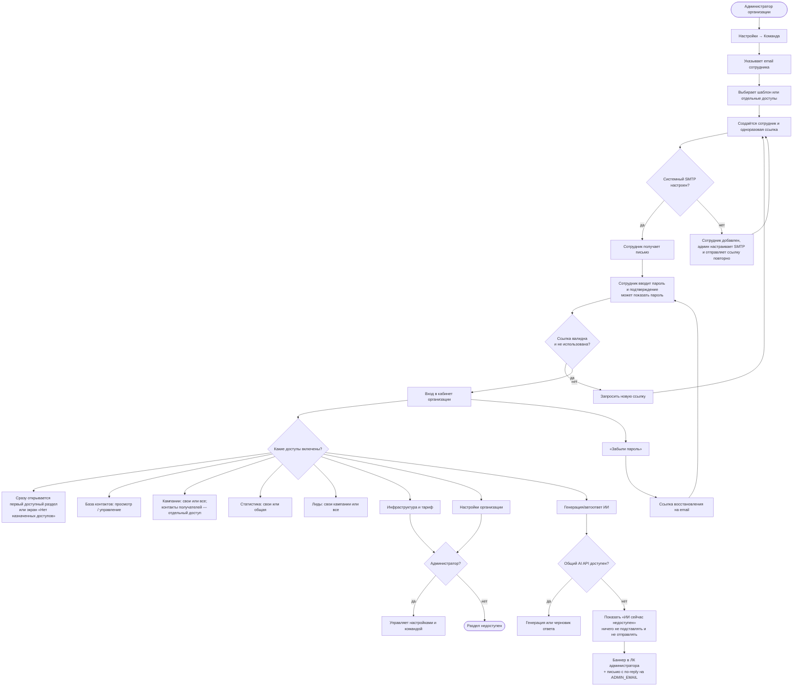

# Кабинет организации: приглашения, доступы и пароль

Кабинет принадлежит организации, а не отдельному сотруднику. Администратор добавляет коллег по email, выбирает стартовый набор доступов и при необходимости включает каждый доступ отдельно. Ссылки на установку и восстановление пароля одноразовые, в базе хранится только хеш токена.

Доступы проверяются на сервере для каждого действия, а не только скрывают кнопки. Если для страницы доступна лишь часть действий, недоступные элементы остаются серыми и объясняют причину при нажатии. Право «Контакты получателей кампании» дополнительно защищает имя, компанию, email и персональный предпросмотр письма. Сотрудник работает с общими данными организации; автор кампании фиксируется отдельно, чтобы ограничение «только свои кампании/лиды» было проверяемым.

Недоступность общего API фиксируется как инцидент: баннер видит только администратор организации, а письмо отправляется не чаще раза в 15 минут для каждого сервиса. При следующем успешном запросе инцидент закрывается автоматически.
