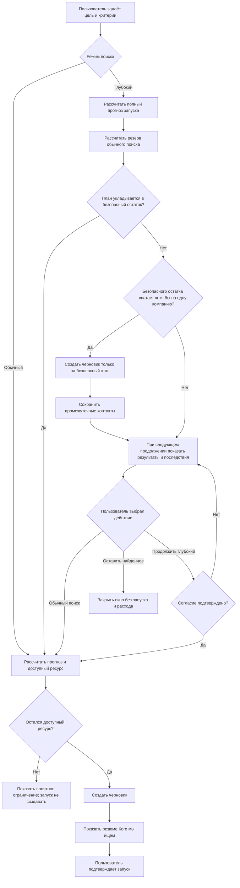
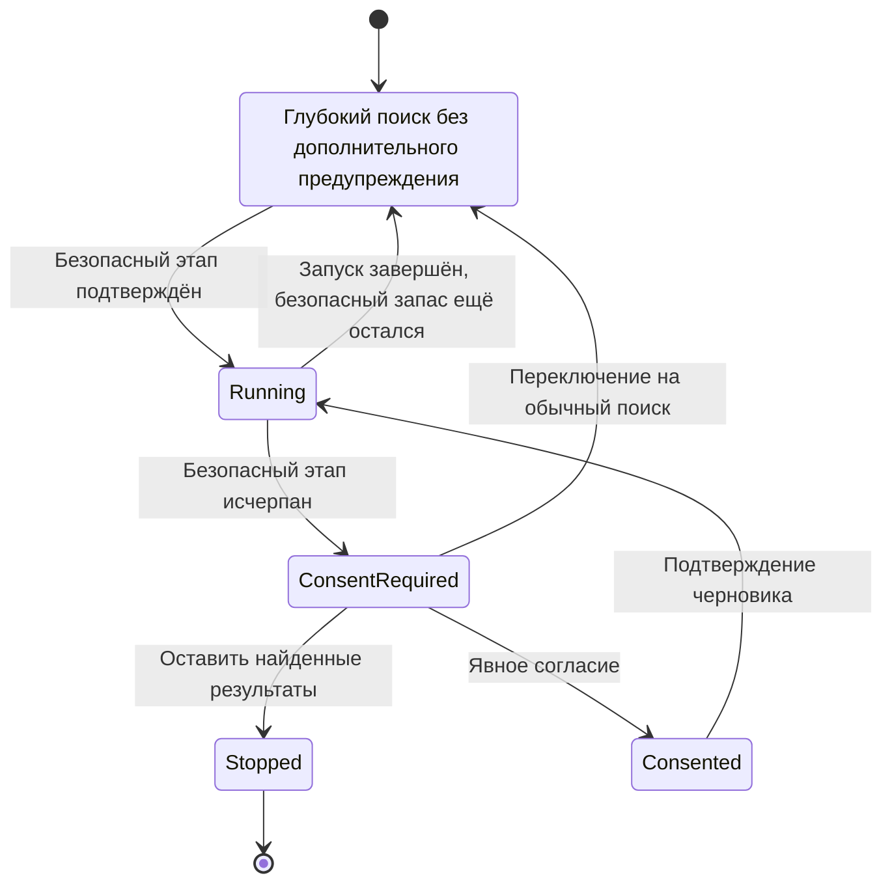
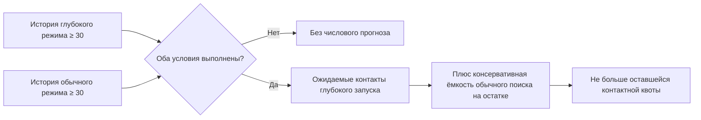

# Политика лимитов поиска

Этот документ — внутренняя спецификация. Пользователь не видит баллы, коэффициенты режимов, резерв или технические пороги. В продукте отображается только единая шкала **«Лимиты поиска»** от 0 до 100%, прогноз результата и последствия выбора режима.

## Цели политики

1. Обычный поиск должен в среднем позволять получить месячную квоту контактов тарифа.
2. Небольшой объём глубокого поиска доступен без предупреждений.
3. Глубокий поиск не может незаметно израсходовать ресурс, зарезервированный для общей контактной квоты.
4. После безопасной границы пользователь может продолжить глубокий поиск только после явного согласия получить меньше контактов.
5. Числовой прогноз показывается только при достаточной истории. Необоснованная точность запрещена.

## Внутренняя модель

| Параметр | Правило |
|---|---|
| Стоимость проверки компании | обычная — 1 внутренняя единица; глубокая — 4 |
| Безопасная доля глубокого поиска | не более 10% общего ресурса периода и только сверх резерва обычного поиска |
| Резерв обычного поиска без истории | 0,42 контакта на проверенную компанию с запасом 5% |
| Персональный прогноз | включается после 30 проверенных компаний в соответствующем режиме |
| Запас обычного поиска | до 2% сверх внутреннего лимита, только если глубокий поиск в периоде не использовался |
| Шкала пользователя | `min(100%, взвешенный расход / лимит × 100%)` |
| Период | Первый доступ действует 45 дней с бонусом на прогрев; следующая оплата добавляет 30 дней к неистёкшему сроку либо начинает новый 30-дневный период после паузы; весь срок пробного тарифа для Trial |

Обозначения:

- `L` — внутренний ресурс периода;
- `U` — уже использованный ресурс;
- `D` — ресурс, использованный глубоким поиском;
- `R = max(0, L − U)` — остаток;
- `Q` — ещё доступная контактная квота;
- `r` — консервативная конверсия обычного поиска.

Резерв обычного поиска:

```text
standard_reserve = ceil(Q / r × 1.05)
```

Безопасный остаток глубокого поиска:

```text
safe_deep = min(
  max(0, floor(L × 0.10) − D),
  max(0, R − standard_reserve)
)
```

Если планируемый глубокий поиск требует больше `safe_deep`, сервер сначала создаёт черновик только на безопасную часть. Контакты этого этапа сохраняются как промежуточный результат. Когда `safe_deep` становится меньше стоимости одной глубокой проверки, следующий запуск без отдельного согласия уже не создаётся.

## Поток запуска



## Состояния глубокого поиска



## Прогноз количества контактов

До накопления истории прогноз конверсии используется только для внутреннего планирования. Пользователь видит текст:

> На текущем количестве данных недостаточно, чтобы предсказать число найденных контактов при этих параметрах.

Числовой максимум после согласия показывается, только если и обычный, и глубокий режимы имеют не менее 30 проверенных компаний. Текущая реализация использует историю аккаунта по режиму, а не отдельную статистику каждого набора фильтров. Поэтому значение формулируется как ориентир, а не гарантия.



## Пользовательский интерфейс

- Заголовок: **«Лимиты поиска»**.
- Основное значение: процент использования после планируемого запуска.
- Серый участок шкалы: уже использовано.
- Зелёный участок: расход планируемого запуска.
- Подсказка: «Остатка хватит примерно на N контактов обычного поиска», где `N` динамически пересчитывается по фактическому остатку, включая уже потраченный ресурс глубокого поиска.
- Никаких слов «баллы», внутренних коэффициентов, количества запросов поставщикам или их названий.
- При достижении 100% шкала визуально не переполняется.
- Контакты сверх цели, найденные в последней уже проверенной компании, сохраняются пользователю бесплатно; это не расширяет ресурс проверки компаний.

## Строгие инварианты

1. Ответ с предупреждением не создаёт `ProspectingRun` и ничего не расходует; предшествующий безопасный этап является отдельным подтверждённым запуском.
2. Согласие относится к одному следующему глубокому запуску и записывается в его внутренний query-аудит.
3. Изменение режима на обычный отменяет ожидающее согласие.
4. Глубокий поиск никогда не получает запас обычного режима сверх 100%.
5. Обычный режим получает запас 2% только при `deepUsed = 0`.
6. Ошибка подготовки или недостаток ресурса не создают запуск.
7. Уже сохранённые контакты не удаляются при отказе от продолжения.
8. Поставщики, цены, веса и формулы не попадают в клиентский текст.

## Контрольные сценарии

| Сценарий | Ожидаемое поведение |
|---|---|
| Первый глубокий поиск на 5 контактов в начале Basic | проходит без дополнительного согласия |
| Первый глубокий поиск с большой целью | создаёт черновик на безопасный этап и заранее объясняет, что результат промежуточный |
| Следующий аналогичный глубокий поиск после почти полного безопасного расхода | требует согласия |
| Недостаточно истории | окно согласия не показывает числовой максимум |
| Есть ≥30 наблюдений в обоих режимах | показывает ориентировочный максимум |
| Только обычный поиск | допускает небольшой технический запас; шкала остаётся на 100% |
| После любого глубокого поиска | технический запас обычного режима отключён |
| Пользователь закрывает предупреждение | новый запуск и расход отсутствуют |
